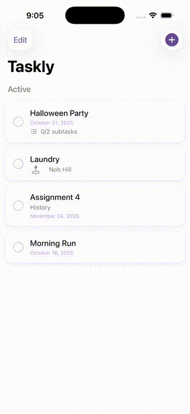

# ✅ Taskly

A clean, minimal **to-do list iOS app** built with **SwiftUI** and **SwiftData** — designed for clarity, speed, and delight ✨

---

## 📱 Demo

<p align="left">
  
</p>

*(Recorded directly from the iPhone simulator — add, edit, and manage your tasks with ease.)*

---

## 🧠 Features

* 🗒️ **Add, edit, and delete tasks** with a modern SwiftUI interface
* ✅ **Mark tasks complete** with smooth haptic feedback
* 📆 **Optional due dates** to stay organized
* 🪶 **Subtasks** — break down big goals into actionable steps
* 📍 **Location picker** — attach a place (with search & map view) to any task
* 💾 **Automatic persistence** using SwiftData
* 🧩 **Active vs. Completed sections** for better focus
* ✏️ **Inline editing** when tapping a task
* 💫 **Lightweight, fluid SwiftUI animations** for a native iOS feel

---

## 🧰 Tech Stack

| Layer            | Technology                |
| :--------------- | :------------------------ |
| UI               | SwiftUI                   |
| Data Persistence | SwiftData                 |
| Maps & Location  | MapKit                    |
| Haptics          | UIKit feedback generators |
| Language         | Swift                     |
| IDE              | Xcode (15+)               |
| Target           | iOS 17+                   |

---

## 🗂️ Project Structure

```
Taskly/
├── TasklyApp.swift         // app entry point
├── ContentView.swift       // main task list
├── AddTaskView.swift       // task + subtask + location form
├── Task.swift              // SwiftData model definitions
├── TaskRow.swift           // reusable row component
├── Haptics.swift           // haptic feedback helper
├── Color+Extension.swift   // app color palette
└── Assets.xcassets/        // icons, colors, app images
```

---

## 🚀 Getting Started

### 1️⃣ Clone the repo

```bash
git clone https://github.com/RJoshi141/Taskly.git
cd Taskly
```

### 2️⃣ Open in Xcode

* Open `Taskly.xcodeproj`
* Select an **iPhone simulator**
* Press **⌘R** to run

### 3️⃣ Explore ✨

Add new tasks → add subtasks → attach a location → mark as complete

---

## 🎨 Coming Soon

* 🎨 Custom app icon & refined theme
* 🌙 Dark-mode polish
* 🔍 Task search & smart filters
* ☁️ iCloud sync via CloudKit
* 🧩 Home-screen widgets
* 🎉 Confetti animation when all tasks are completed

---

## 👩‍💻 Author

**Ritika Joshi**
[GitHub @RJoshi141](https://github.com/RJoshi141) • [LinkedIn](https://linkedin.com/in/ritikajoshi141)

---

### ⭐️ Support

If you like **Taskly**, please consider starring ⭐ the repo to support future updates and features!
