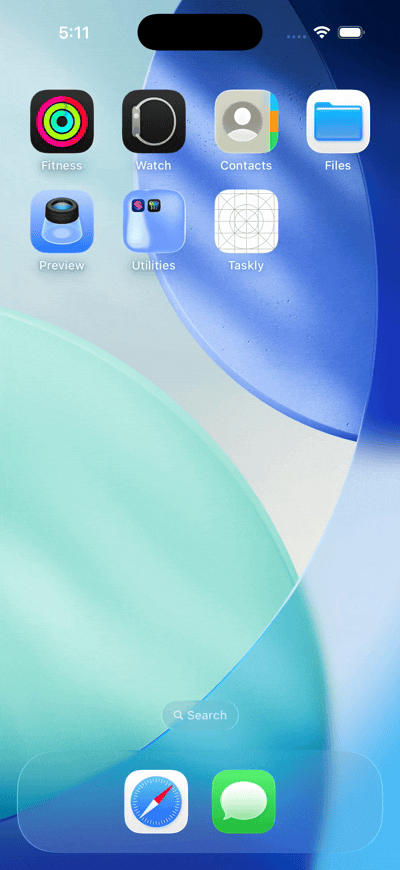

# ✅ Taskly

A clean, minimal **to-do list iOS app** built with **SwiftUI** and **SwiftData** — designed for simplicity, speed, and delight ✨  

---

## 📱 Demo




*(Quick demo recorded from iPhone simulator — add, mark, and manage your daily tasks effortlessly.)*

---

## 🧠 Features

- 🗒️ Add, edit, and delete tasks  
- ✅ Mark tasks complete with one tap (with haptic feedback)  
- 📆 Optional due dates  
- 💾 Auto-save persistence using SwiftData  
- 🧩 Organized “Active” and “Completed” sections  
- 🪄 Lightweight, fluid SwiftUI animations  

---

## 🧰 Tech Stack

| Layer | Technology |
|:--|:--|
| UI | SwiftUI |
| Data Persistence | SwiftData |
| Haptics | UIKit feedback generators |
| Language | Swift |
| IDE | Xcode (15+) |
| Deployment | iOS 17+ |

---

## 🗂️ Project Structure

```

Taskly/
├── TasklyApp.swift         // app entry point
├── ContentView.swift       // main list screen
├── Task.swift              // SwiftData model
├── AddTaskView.swift       // add new task form
├── TaskRow.swift           // reusable row UI
├── Haptics.swift           // haptic helper
└── Assets.xcassets/        // colors, icons, images

````

---

## 🚀 Getting Started

### 1️⃣ Clone the repo
```bash
git clone https://github.com/RJoshi141/Taskly.git
cd Taskly
````

### 2️⃣ Open in Xcode

* Open `Taskly.xcodeproj` or `Taskly.xcworkspace`
* Select an **iPhone simulator**
* Press **⌘ R** to run

### 3️⃣ Enjoy ✨

* Add tasks → mark complete → relaunch to see persistence

---

## 🎨 Coming Soon

* Custom app icon & color theme
* Dark-mode polish
* Search & filter
* iCloud sync (CloudKit)
* Widgets

---

## 🧑‍💻 Author

**Ritika Joshi**
[GitHub @RJoshi141](https://github.com/RJoshi141) • [LinkedIn](https://linkedin.com/in/ritikajoshi141)

---

### ⭐️ Support

If you like Taskly, consider starring ⭐ the repo to support future updates!
